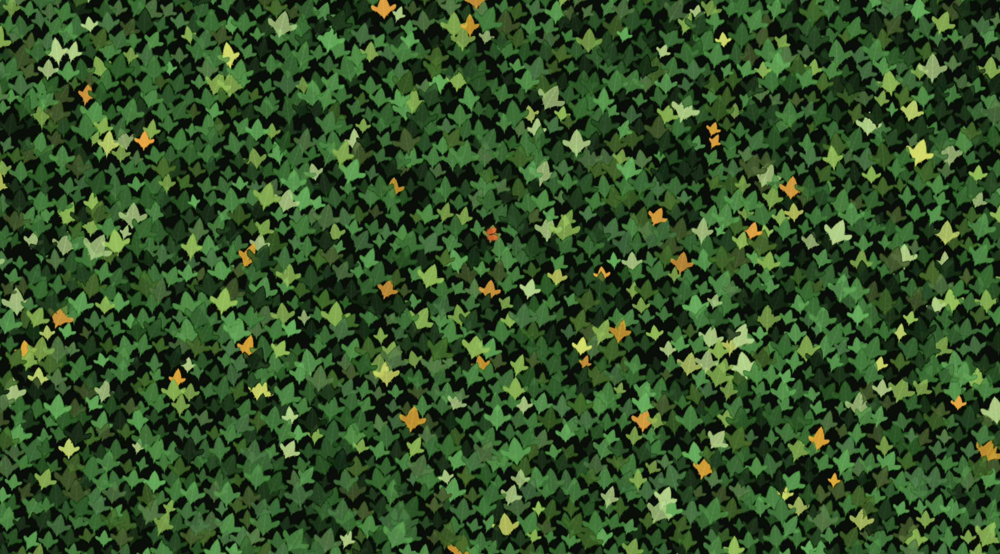

# 🍃 LeafWall

An interactive animated wallpaper of dense Boston Ivy (*Parthenocissus tricuspidata*) covering a wall — with a butterfly drifting through.

## Demo

Open `index.html` in any modern browser. No build step, no dependencies.

## Features

- **Dense ivy wall** — hundreds of leaves tiled across the full canvas, rooted to fixed anchor points like real ivy on a wall. Leaves sway gently in place; they never fall or drift away.
- **Realistic leaf shapes** — three hand-crafted Boston Ivy morphologies (adult 3-lobed, young, mature wide-lobe) with serrated margins, cordate base, and detailed vein structure drawn per leaf.
- **Wind physics** — a spring-damper system drives each leaf's sway angle. A global wind oscillator shifts all leaves together; individual phases and depths create natural variation across the wall.
- **Mouse interaction** — moving the cursor disturbs nearby leaves, pushing them away from the cursor with a smooth spring response. A soft radial glow follows the cursor.
- **Butterfly** — a small Monarch-style butterfly wanders across the wall at a gentle pace. On mouse proximity it changes direction and flies away. Drawn with animated wing-beat (X-axis fold) and a warm orange glow.
- **Layered depth** — leaves are sorted back-to-front by a depth value, creating natural overlap and parallax response to wind.

## Customisation

All tuning parameters are at the top of the `<script>` block in `index.html`:

| Parameter | Location | Effect |
|-----------|----------|--------|
| `gx`, `gy` | `buildWall()` | Grid cell size — smaller = more leaves |
| `size` range | `buildWall()` | Leaf size in pixels (currently 22–44 px) |
| `freq`, `amp` | `buildWall()` | Sway speed and tilt range per leaf |
| `stiffness`, `damping` | draw loop | Spring snappiness |
| `wind.target` range | `newWindTarget()` | Max wind strength |
| `GREENS` / `ACCENT` | colour section | Leaf colour palette |
| `butterfly.speed` | `Butterfly` class | Butterfly cruising speed |

## Browser support

Works in all evergreen browsers (Chrome, Firefox, Safari, Edge). Uses `Canvas 2D`, `Path2D`, and `requestAnimationFrame` — no WebGL required.

## License

MIT
